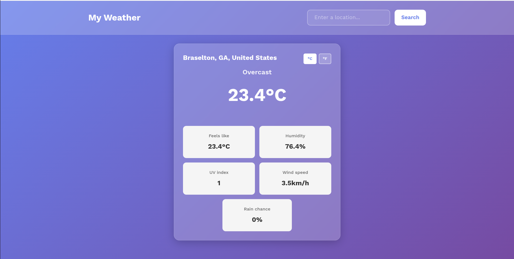
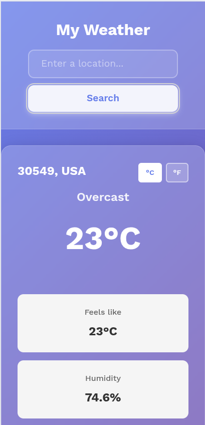
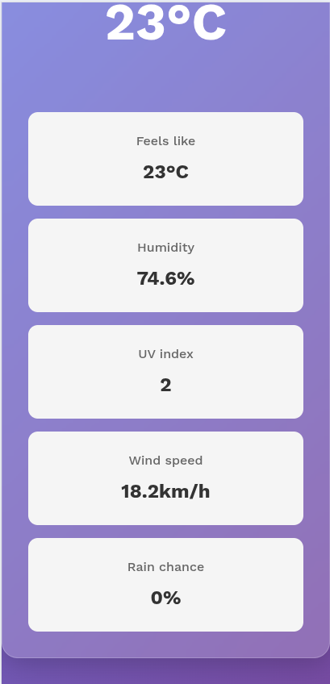

# 🌤️ My Weather

A modern, responsive weather application built with vanilla JavaScript that fetches real-time weather data and displays it with a beautiful glassmorphism design.



<!-- Agrega un screenshot después -->

## ✨ Features

- 🔍 Search weather by city name
- 🌡️ Toggle between Celsius and Fahrenheit
- 💨 Display current conditions including:
  - Temperature and "feels like"
  - Humidity levels
  - Wind speed
  - UV index
  - Precipitation probability
- 🎨 Modern glassmorphism UI design
- 📱 Fully responsive (mobile, tablet, desktop)

## 🛠️ Technologies Used

- **HTML5**
- **CSS3** (Flexbox, Grid, Glassmorphism)
- **JavaScript (ES6+)**
  - ES Modules
  - Async/Await
  - Fetch API
- **Webpack** (Module bundler)
- **Visual Crossing Weather API**

## 📦 Installation

1. Clone the repository:

```bash
git clone https://github.com/javgiu/weather-app.git
cd weather-app
```

2. Install dependencies:

```bash
npm run installations
```

3. Get your API keys:

- Sign up at [Visual Crossing](https://visualcrossing.com)
- Get your free API key with (1000 requests/day)

4. Add your API key:

- Open src/modules/weatherAPI.js
- Replace the API key with your own

5. Run the development server

```bash
npm run dev
```

6. Build your production

```bash
npm run build
```

## 🚀 Live Demo

[View Live Demo](https://your-username.github.io/weather-app/)

### Desktop Wiew


### Mobile Wiew




## 📝 Project Structure

```
weather-app/
├── src/
│ ├── modules/
│ │ ├── weatherAPI.js # API calls
│ │ ├── weatherData.js # Data processing
│ │ └── domHandler.js # DOM manipulation
│ ├── styles/
│ │ ├── reset.css # CSS reset
│ │ ├── base.css # Base styles
│ │ ├── form.css # Form styles
│ │ ├── weather-card.css # Card styles
│ │ └── styles.css # Main CSS entry
│ ├── template.html
│ └── index.js # Main JS entry
├── dist/ # Build output
├── webpack.config.js
├── package.json
└── README.md
```

## 👨‍💻 Author

Javier Picallo Ortega

- GitHub: [@javgiu](https://github.com/javgiu)

## 📄 License

This project is open source and available under the MIT License.

## 🙏 Acknowledgments

Weather data provided by [Visual Crossing Weather API](https://www.visualcrossing.com)

Project inspired by [The Odin Project](https://www.theodinproject)

Font: [Work Sans](https://fonts.google.com/specimen/Work+Sans) by Wei Huang
